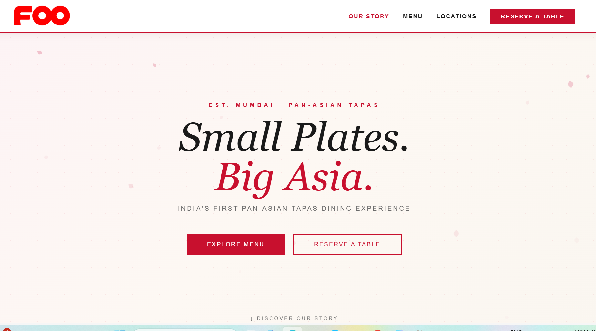
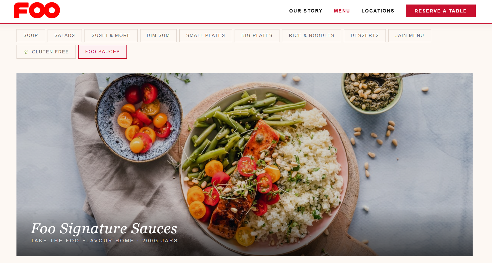
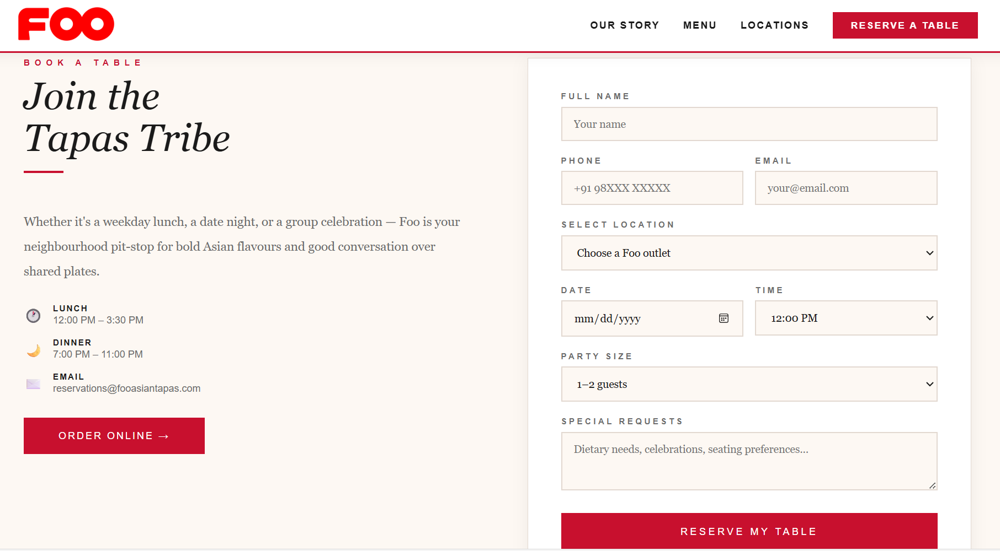

# Foo Pan Asian Website (AI-Assisted Project)

## Overview
This repository contains the **Foo Pan Asian** restaurant website, created using **Claude AI artifacts** to demonstrate how AI tools can accelerate front‑end development and deployment.
The site showcases a modern Pan Asian dining experience with a clean, responsive design.

## 🚀 Live Demo
[View Website](https://foopanasian.netlify.app/)

## Features
- 🍜 **Homepage** with hero banner introducing Foo Pan Asian
- 📖 **Menu section** highlighting Pan Asian dishes
- 🏠 **About section** describing the restaurant’s story and ambiance
- 📞 **Contact section** with form and location details
- 📱 **Responsive design** optimized for mobile and desktop
- 🌐 **Deployed on Netlify** for fast, reliable hosting

## AI Workflow
This project was generated using Claude AI artifacts to:
- Prototype HTML, CSS, and JavaScript quickly
- Design responsive layouts and user‑friendly UI components
- Structure project files for GitHub and Netlify deployment

## Screenshots

### Homepage

### Menu Section

### Contact Section

